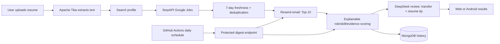

# JobLens AI

JobLens is an explainable job-matching system with a browser experience, a native Android client, and a Java cloud backend. A user can upload a PDF/DOCX resume, search fresh Google Jobs results, review a 0–100 match score with reasons, and subscribe to a daily email containing up to 10 new jobs.

> Portfolio status: the product workflow is implemented and builds locally. A public demo URL and signed APK will appear in this README after the owner configures the external service credentials and completes the first deployment.

## What is implemented

- Resume text extraction from PDF, DOC/DOCX, and text files with Apache Tika.
- Hybrid matching: hard eligibility for career track, role family/specialization, and location, followed by explainable role/required/preferred/evidence scoring.
- Optional OpenAI-compatible DeepSeek semantic review for transferable-skill judgment and two-sentence resume advice; the deterministic score remains available as a provider-free fallback.
- Freshness filtering for jobs posted in the last seven days.
- Per-user deduplication and recommendation history in MongoDB Atlas.
- Nationwide U.S. fan-out across prioritized state-level SerpAPI searches.
- Browser demo, native Android search/history UI, and an operations dashboard.
- Installable web-app metadata for adding JobLens to an iPhone or Android home screen.
- Daily Top 10 digest orchestration through GitHub Actions and a token-protected backend endpoint.
- Email delivery through the Resend HTTPS API with a per-user/day idempotency key.
- Docker deployment blueprint for Render and CI for the Java backend and Android app.
- Signed Android APK release workflow for GitHub Releases.

## Product flow



## Eligibility and match score

The search form exposes exactly three user-facing career tracks: `Internship`, `New Graduate / Early Career`, and `General Full-time`. Career track, role family/specialization, and location are hard eligibility decisions. An explicit mismatch is removed before ranking; missing job metadata is retained as `UNKNOWN` and shown as unverified. Skill gaps lower a score but never silently remove an otherwise eligible role.

Each eligible role receives an auditable deterministic score:

- `roleFitScore` × 0.40
- `requiredSkillScore` × 0.35
- `preferredSkillScore` × 0.15
- `evidenceFitScore` × 0.10

All components and the deterministic score are integers from 0 to 100. If semantic review is enabled, the final score blends 55% deterministic score with 45% DeepSeek semantic score. Every result also includes evidence lists, `eligibilityStatus`, and `scoringVersion`.

When `QWEN_API_KEY`, `QWEN_BASE_URL`, and `QWEN_MODEL` are all set, the backend sends only the top 20 eligible candidates to the configured OpenAI-compatible model. The model can recognize transferable experience that does not share exact resume keywords, add a concise rationale, and produce a truthful two-sentence resume tip tied to an existing bullet. The deterministic score remains the fallback when the provider is disabled, unavailable, or returns invalid JSON.

Example provider settings:

```text
# Recommended for this project: DeepSeek's inexpensive chat model
QWEN_BASE_URL=https://api.deepseek.com
QWEN_MODEL=deepseek-flash

# The same adapter can point at another OpenAI-compatible provider if needed.
# Keep the variable names unchanged so Render and local deployments share one contract.
```

DeepSeek is the recommended provider for this portfolio because the task is short structured text review rather than generation of long documents. Keep the provider fields secret and monitor quota; if they are blank or the provider fails, JobLens still returns deterministic scores and reasons.

## API

| Method | Endpoint | Purpose |
| --- | --- | --- |
| `GET` | `/api/health` | Deployment health check |
| `POST` | `/api/resumes/extract` | Extract text from a multipart resume upload (`resume`) |
| `POST` | `/api/recommendations` | Search, rank, deduplicate, and return jobs |
| `GET` | `/api/history?userId=...` | Return one user's recommendation history |
| `POST` | `/api/subscriptions` | Upsert a daily-digest profile |
| `POST` | `/api/digests/run` | Run all active digests; requires bearer token |
| `GET` | `/dashboard` | View request and third-party API analytics |

Example recommendation request:

```json
{
  "userId": "demo-user",
  "role": "Data Engineer",
  "location": "United States",
  "careerTrack": "NEW_GRADUATE",
  "specialization": "Data Platform",
  "searchScope": "NATIONWIDE_US",
  "resumeText": "Python SQL Spark Airflow AWS ETL",
  "limit": 10
}
```

## Stack

- Java 17, Servlets/JSP, Maven, Tomcat 9
- MongoDB Atlas
- SerpAPI Google Jobs
- Apache Tika 3.3.2
- Resend email API
- DeepSeek (OpenAI-compatible chat completions; optional)
- Native Android (Java, Material components, OkHttp)
- Docker, Render Blueprint, GitHub Actions

## Local verification

Backend:

```bash
mvn --file backend/pom.xml test
```

Android:

```bash
cd android-app
./gradlew testDebugUnitTest assembleDebug
```

Set the Android API URL without editing source code:

```bash
./gradlew assembleDebug -PjoblensApiBaseUrl=https://your-api.example.com
```

## Deploy the public web/API demo

For local development, keep secrets in `JobLens/.env` (Windows path: `D:\MISM\Collection\JobLens\.env`) and load them into your IDE or process environment; `.env` is ignored by Git and is never committed. The Java backend reads OS environment variables, so do not paste secrets into source files.

Configure each service in its own dashboard, then copy only the values into Render's environment-variable form:

| Service | Where to configure it | Value used by JobLens |
| --- | --- | --- |
| MongoDB Atlas | Atlas project → Database Access (create a least-privilege user), then Connect → Drivers | `MONGODB_URI` |
| SerpAPI | SerpAPI dashboard → API Key | `SERPAPI_API_KEY` |
| Resend | Resend dashboard → API Keys; verify a sending domain under Domains | `RESEND_API_KEY`, `DIGEST_FROM_EMAIL` |
| DeepSeek | DeepSeek Platform → API Keys | `QWEN_API_KEY`, `QWEN_BASE_URL=https://api.deepseek.com`, `QWEN_MODEL=deepseek-flash` |
| Render | New → Blueprint → select this repo → Environment | all server variables in `.env.example` |
| GitHub Actions | Repository Settings → Secrets and variables → Actions | `JOBLENS_API_URL`, `DIGEST_TRIGGER_TOKEN`, and APK signing secrets |

In Render, create a Blueprint from this repository. `render.yaml` builds the root `Dockerfile` and checks `/api/health`. Set the optional DeepSeek variables to enable semantic review; leave all three blank for deterministic-only matching. Copy the generated `DIGEST_TRIGGER_TOKEN` into the same-named GitHub Actions secret, then set `JOBLENS_API_URL` to the actual service origin shown in the Render dashboard (do not add `/api`). The Android release build should use that same origin through `JOBLENS_API_BASE_URL`.

Render free services can sleep after inactivity, so the first request may be slower. The scheduled GitHub Actions request wakes the service before invoking the daily workflow.

## Publish an installable Android APK without an app store

The app is Android, so the downloadable package is an `.apk`; no Apple Developer Program membership is involved. The `release-apk.yml` workflow publishes a signed APK whenever a tag such as `v1.2.0` is pushed.

For iPhone users, deploy the browser experience over HTTPS and use Safari's **Add to Home Screen** action. It opens in standalone web-app mode and avoids native iOS distribution fees.

Configure these GitHub Actions secrets once:

- `JOBLENS_API_BASE_URL`
- `JOBLENS_KEYSTORE_BASE64`
- `JOBLENS_KEYSTORE_PASSWORD`
- `JOBLENS_KEY_ALIAS`
- `JOBLENS_KEY_PASSWORD`

Then create and push a version tag. The workflow attaches `JobLens-v1.2.0.apk` to a GitHub Release, which can be linked directly from a portfolio website. Users must allow installation from their browser/files app because the APK is distributed outside Google Play.

## Privacy and operational notes

- Secrets are environment variables and are excluded from Git.
- Resume text is only persisted when a user explicitly subscribes to daily email. If LLM reranking is enabled, resume text and top candidates are sent to the configured provider for semantic review.
- The upload endpoint limits files to 5 MB and extracted text to 30,000 characters.
- The digest trigger uses a constant-time bearer-token comparison.
- Recommendation history is written only after the email provider accepts a digest, preventing failed sends from consuming unseen jobs.
- Before a public launch, add authentication, delete/export controls, consent copy, rate limiting, and a retention policy for resume data.

## Repository structure

```text
backend/       Java Servlet backend, web demo, dashboard, tests
android-app/   Native Android client
.github/       CI, daily digest, and APK release workflows
Dockerfile     Reproducible Tomcat deployment
render.yaml    Render infrastructure blueprint
```

## Author

Raina Qiu · Carnegie Mellon University
